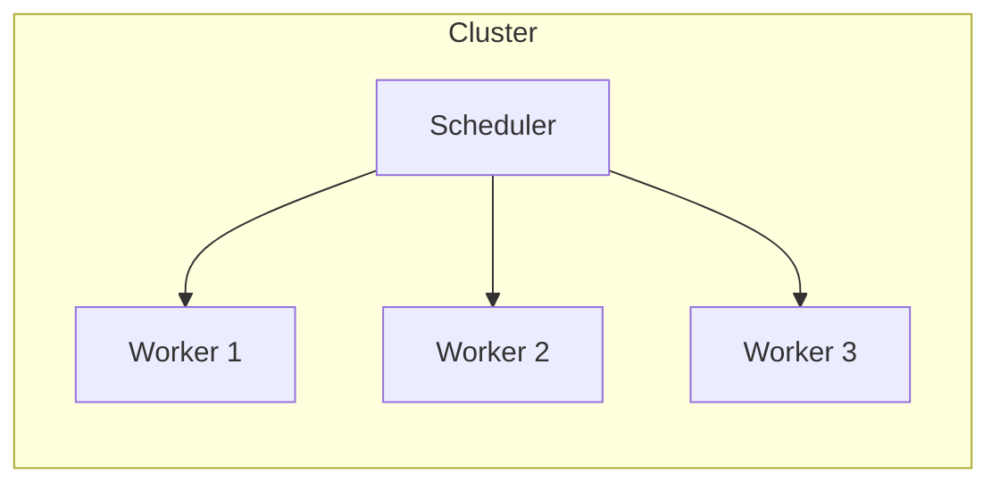

---
# You can also start simply with 'default'
theme: default

title: Async to Distributed - Concurrency Patterns for Data Processing
info: |
  Jakub Urban

# apply unocss classes to the current slide
# class: text-center
# https://sli.dev/custom/highlighters.html
highlighter: shiki
# https://sli.dev/guide/drawing
drawings:
  persist: false
# slide transition: https://sli.dev/guide/animations#slide-transitions
transition: slide-left
# enable MDC Syntax: https://sli.dev/guide/syntax#mdc-syntax
mdc: true

layout: cover

---

# [Async to Distributed: Concurrency Patterns for Data Processing]{style="color:#9F0162"}
## Jakub Urban *[@ Stealth]{style="color:#4D4DF4"}*

---
layout: center
---

# Content

1. Introduction to concurrency and parallelism
2. Python's built-in concurrency primitives
3. Scaling out: Distributed computing with Dask and Ray

---
layout: section
---

# [1. Introduction to concurrency and parallelism]{style="color:#9F0162"}


---
layout: two-cols-header
---

# Concurrency lets you wait efficiently

::left::

- Concurrency enables you doing other things while waiting for results or other resources.
  - For example, you can wait for multiple calculations or API responds.
  - It's like a superpower of **waiting** in multiple queues at once.
- You do not need to care how the work to clear a queue is done.

::right::

::v-click


([Foto: Archiv Ladislava Růžičky](https://magazin.aktualne.cz/nemame-zeptejte-se-po-novem-roce-nakupy-za-socialismu-v-cesk/r~49f5bc5a5eba11eebe29ac1f6b220ee8/))
- Would be great for (Czech socialist) queues
  - Sometimes people even did not know what they were waiting for.
  - Wait in multiple queues at once would help.
::

---
layout: two-cols-header
---

# Parallelism lets you *execute* multiple things at once

::left::

- Parallelism is about executing multiple things simultaneously.
- Concurrency does not imply parallelism.
  - Although parallelism is typically desired in concurrent systems.
- Examples of parallel calculation:
  - GPU's or vectorized CPU operations (SIMD - single instruction multiple data).
  - Multi-core machines with shared memory (MIMD - multiple instructions multiple data).
  - Distributed systems: clusters, clouds (MIMD).

::right::

::v-click


::

---

# Data processing cares about both concurrency and parallelism

- In data processing, we often care about both concurrency and parallelism.
  - We need processes to be responsive → concurrency.
  - We need to execute processing tasks fast and efficiently → parallelism.

---
layout: section
---

# [2. Python's built-in concurrency primitives]{style="color:#9F0162"}

---

# Python defines built-in concurrency primitives

- `concurrent.futures`
  - > ... provides a high-level interface for asynchronously executing callables.
  - Proposed in 2009: [PEP-3148](https://peps.python.org/pep-3148)
  - We will focus on using and building on these primitives.
- Other standard lib [modules for concurrent execution](https://docs.python.org/3/library/concurrency.html) include:
  - `threading` and `multiprocessing`: parallelism, synchronisation primitives.
  - `subprocess`: subprocess management.
  - `asyncio`: cooperative multitasking.

---

# `from concurrent.futures import Executor`
> Executor is an abstract class that provides methods to execute calls asynchronously.
- This is indeed abstract 😅
- What does one need in particular?
  1. Create an executor: Choose type and parameters.
  2. Submit tasks to the executor.
  3. Collect results.
  4. Shutdown the executor.

---

# 1. Create an executor

```python
from concurrent.futures import ThreadPoolExecutor, ProcessPoolExecutor

MAX_WORKERS = 4

thread_executor = ThreadPoolExecutor(max_workers=MAX_WORKERS)
process_executor = ProcessPoolExecutor(max_workers=MAX_WORKERS)
```

---

# 2. Submit tasks to the executor

```python
def do_some_math(x: float) -> float:
    return x * x
```

1. Single calculation via `submit`:
```python
result = thread_executor.submit(do_some_math, 5)
```

2. Multiple calculations via `map`:
```python
results = thread_executor.map(do_some_math, range(10))
```

---

# 3a. Collect result: single `Future`

- The output of `submit` is a `concurrent.futures.Future` object:

```python
result = thread_executor.submit(do_some_math, 5)
print(result)
```

```
<Future at 0x122921490 state=finished returned int>
```

- `Future` is a placeholder for the result of a computation that may not be completed yet.
- `Future` encapsulates the asynchronous execution.
- Most important `Future` methods are:
  - `result(timeout=None)`: Waits for the computation to complete and returns the result.
  - `done()`: Returns `True` if the call was successfully cancelled or finished running.
  - `cancel()`: Attempts to cancel the computation.

---

# 3b. Collect multiple results

- The output of `map` is a generator object:

```python
results = thread_executor.map(do_some_math, range(10))
print(results)
```

```
<generator object Executor.map.<locals>.result_iterator at 0x122a1f4d0>
```

- This generator yields results as they become available, *in the order* they were submitted.
- One would typically iterate over the generator:

```python
for result in results:
    ...
```

- or collect all results into a list:

```python
completed_results = list(results)
```

- Slow tasks may block the iteration (although do not block the execution in the workers).

---

# 3c. Collect multiple results with `as_completed`

- We can submit multiple tasks without using executor's `map` method.
  - This will yield multiple `Future` objects.

```python
futures = [executor.submit(do_some_math, x) for x in range(10)]
```

or using built-in `map`:
```python
futures = map(functools.partial(executor.submit, do_some_math), range(10))
```

- `as_completed` iterates over a collection of futures as they complete:
  - Can specify waiting timeout.

```python
from concurrent.futures import as_completed

for future in as_completed(futures):
    print(future.result())
```

---

# 3d. Collect multiple results with `wait`

- `wait` gives us more flexibility and control over the futures while waiting.
  - We can use waiting timeout.
  - Can wait for first completed, all completed, or first exception.
  - For example, we can use a few first completed results and cancel the rest.

```python
done, not_done = wait(futures, timeout=1, return_when=FIRST_COMPLETED)
```

- `done` and `not_done` are sets of futures.

---

# 4. Shutdown the executor

- Executors should be shutdown to release resources.
  - This may be done automatically when the executor is garbage collected.
  - The type and released resources depend on the executor type.

```python
executor.shutdown(wait=True, cancel_futures=False)
```

- `wait=True` blocks until all futures are completed and resources are freed.
- `cancel_futures=False` cancels pending futures tha have not started running.

- Lifetime can also be managed by a `with` block:

```python
with ThreadPoolExecutor(max_workers=4) as executor:
    result = executor.submit(do_some_math, 5)
```

---

# Gotcha example: A non-obvious random numbers stale state

```python
list(process_executor.map(np.random.randint, 8*[100]))
```

```
[51, 51, 51, 51, 51, 51, 51, 51]
```

- Surprisingly, random generator state is shared and not mutated.
- 💡 `randint` is not a (pure) function, it's a `RandomState` instance's method.

---

# `ThreadPoolExecutor` limitation: Global Interpreter Lock (GIL)

- Global Interpreter Lock (GIL) is probably the most (in)famous limitation of CPython.
- GIL prevents multiple threads from executing Python code simultaneously (in parallel).
- However, GIL can be released by:
  - I/O operations (file operations, network requests).
  - C extensions (NumPy, Pandas, TensorFlow).
- ... thus enabling threads to run in parallel.


---

# `ProcessPoolExecutor` limitation: Serialization

- Submitted tasks, i.e callables and data, are sent as pickles to the worker processes.
- Not all objects can be pickled.
  - E.g., lambda or nested functions.

```python
process_executor.submit(lambda x: x * x, 5).result()
```

```
PicklingError: Can't pickle <function <lambda> ...
```

---

# Resolving serialization issues

- Libraries like `cloudpickle` or `dill` resolve a lot of these limitations.
- Meet our first non-builtin executor: [`joblib/loky`](https://github.com/joblib/loky)
  - > The aim of this project is to provide a robust, cross-platform and cross-version implementation of the `ProcessPoolExecutor` class of `concurrent.futures`.
  - Consistent and robust spawn behaviour
  - Reusable executor
  - Transparent cloudpickle integration

```python
# Create an executor with 4 worker processes, that will
# automatically shutdown after idling for 2s
executor = loky.get_reusable_executor(max_workers=4, timeout=2)
```

- tldr; `loky` is a straightforward replacement for `ProcessPoolExecutor`.

---

# `concurrent.futures` within `asyncio`

- `asyncio` cooperative multitasking enables concurrent code using the `async`/`await` syntax.
  - An internal event loop manages the execution of coroutines.
- `asyncio.Future` is similar to `concurrent.futures.Future`.
  - and can be created from `concurrent.futures.Future`:
  ```python
  concurrent_future = executor.submit(do_some_math, 5)
  asyncio_future = asyncio.wrap_future(concurrent_future)
  await asyncio_future
  ```
  - ... or via `loop.run_in_executor`:
  ```python
  loop = asyncio.get_event_loop()
  asyncio_future = loop.run_in_executor(executor, do_some_math, 5)
  ```

- This basically *removes the usual limitation of `asyncio` not supporting CPU-bound tasks*.

---

# Practical data processing usecases with `concurrent.futures` examples

- Quick parallel batch processing, e.g.:
  - Run Pandas pipeline on multiple files.
  - Grid search hyperparameters.
- Non-blocking data processing in a web server or a streaming processor.
  - Even a single-worker executor can enable non-blocking processing.
  - Especially useful for `asyncio` applications.
- Must be careful with resource utilisation, in particular RAM.

---
layout: section
---

# [3. Scaling out: Distributed computing with Dask or Ray]{style="color:#9F0162"}

---
layout: two-cols-header
---

# Scaling out: Distributed computing

::left::

- At some point, your calculation may not fit into a single machine.
  - Need to process huge datasets.
  - The calculation is too heavy.
  - Too many repetitions (grid search).
- Memory: "My data do not fit into my (computer's) memory."
  - Symptoms: OOM (Out Of Memory) kills, swapping leading to system freeze.
- Processing power: "My calculation takes too long."
  - Symptoms: CPU, GPU, other PU's at 100%, calculation time too long.
- This is where frameworks like Dask or Ray can help.

::right::



---

# Checklist before scaling out

- Before spinning up a cluster (and spending 💰💰💰), there are possibilities:
- Profile and possibly optimise your code.
  - Remember the 80:20 Pareto rule.
  - Save either RAM or CPU.
- Data can (sometimes) be memory-mapped.
- Large data can be processed in chunks.
  - This is where executors can help.
- Dask or Ray can help even when running on a single machine.

---
layout: two-cols-header
---

# Dask (Distributed) and Ray

::left::

> [`Dask`](https://docs.dask.org) is a Python library for parallel and distributed computing.
> - Easy to use and set up (it’s just a Python library)
> - Powerful at providing scale, and unlocking complex algorithms
> - and Fun 🎉

- You may know `Dask` for its `DataFrame` pandas-like API.

::right::

> - [Ray](https://docs.ray.io/) is an open-source unified framework for scaling AI and Python applications like machine learning.
> - It provides the compute layer for parallel processing so that you don’t need to be a distributed systems expert.
> - Ray minimizes the complexity of running your distributed individual and end-to-end machine learning workflows ...

- Ray focuses on machine learning and AI workloads.
- [Ray Core](https://docs.ray.io/en/latest/ray-core/walkthrough.html) provides core primitives for distributed computing, similarly to Dask Future API.


---

# `Dask` Futures API is like `concurrent.futures`

- `Dask` supports a `concurrent.futures`-like interface in its [Futures API](https://docs.dask.org/en/stable/futures.html#api).
- This is the foundation for other APIs like Dask arrays and dataframes.
```python
from dask.distributed import Client, as_completed, wait
dask_client = Client()
```

- `dask.Client` API is similar to `concurrent.futures.Executor`.
```python
dask_future = dask_client.submit(do_some_math, 10)
```

- There are substantial differences, e.g. `map` yields a list of futures, not a generator.
  - Hence, `as_completed` or `wait` should be used to iterate over futures as they complete.
  - This is probably more useful than `concurrent.futures`'s `map`.


---

# Dask provides `concurrent.futures` compatibility

- `distributed.client.Future` is *not* compatible with `concurrent.futures.Future`.
  - This will raise an exception:
  ```python
  concurrent.futures.wait([dask_future])
  ```

- A fully compatible `concurrent.futures` executor can be obtained from `Dask`:
```python
executor = dask_client.get_executor()
```

::v-click
- Need to decide whether to work with `Dask`,
  - and profit from its specific features,
- or with `concurrent.futures` and `Dask` as a backend,
  - and profit from the `concurrent.futures` full compatibility, e.g. within `asyncio`.

::

---

# Dask integrates well with `asyncio`

- Dask can operate in `asyncio` mode by using the `asynchronous=True` parameter.
```python
client = await Client(asynchronous=True)
future = client.submit(do_some_math, 5)
result = await future
```

---

# Dask manages distributed data

- With `concurrent.futures`, data is pickled and sent to workers.
  - This means data has to pass from / to the orchestrator.
  - ... unless you use a distributed storage explicitly.
- Dask primarily stores data in memory and schedules tasks close to data.
  - Can also use distributed storage like HDFS, S3, or GCS.
- Dask can explicitly send and persist data on workers.
  - `scatter` or `persist` in Dask `Client`.
- *References to data can be used as arguments to tasks*.

---

# Task dependencies - call graphs

- Imagine a simple case of two dependent tasks:
```python
data = load_data()
result = process_data(data)
```

- Passing references (`Future`'s) directly would not work with a `concurrent.futures` executor:
```
data_ref = executor.submit(load_data)
result = executor.submit(process_data, data_ref)
```

- Raises a `TypeError` as `process_data` expects data, not a `Future` (which cannot be pickled).

- **Sending futures / references as task argument works directly using Dask or Ray.**
  - It's a very powerful feature for building complex task graphs.
  - The data persistence described above is in fact just a special case of this feature.

---

# Nested tasks - avoiding locking

- Tasks in Dask can submit other tasks.
- Dead-locking needs to be avoided, see [Launch Tasks from Tasks](https://distributed.dask.org/en/stable/task-launch.html).
  - Can happen when a task submits another task but scheduler does not have any free worker slots.
- Dask provides `worker_client` context manager for nested tasks:
```python
def fib(n):
    if n < 2:
        return n
    with dask.distributed.worker_client() as client:
        a_future = client.submit(fib, n - 1)
        b_future = client.submit(fib, n - 2)
        a, b = client.gather([a_future, b_future])
    return a + b
```

---

# Fault tolerance

- Software fails, hardware fails, networks fail, user (codes) fail.
- Dask and Ray can recover from (some) failures.
- Tasks can be retried automatically.
  - With maximum number of retries explicitly specified.


---
dragPos:
  square: 56,852,150,150
---

# Resource requests for task execution

- Resource management is crucial in distributed computing.
  - Not available in `concurrent.futures`.
- Both Dask and Ray support requesting resources for tasks.
  - Resources can be CPU, GPU, memory, or custom (abstract) resources.
- Resource requests *do not* impose limits on actual physical resource usage.
  - Scheduler uses requests for admission control and efficient scheduling.
  - It's up to the task to not use more resources than requested.
- CPU and memory are two fundamentally different types of resources:
  - CPU: Can be "shared" (throttled) ➡️ cannot "run out of CPU".
  - Memory: Finite capacity ➡️ can run out of memory ➡️ process OOM kill.
- A Ray example:
```python
ref = process_data.options(num_cpus=2, memory=1024*1024*1024).remote(data_ref)
```

---

# Summary

* Python provides powerful built-in concurrency abstraction and implementation.
  * `concurrent.futures` is a high-level interface for asynchronous execution.
  * `Executor` and `Future` are the main abstractions that other frameworks build upon.
  * can be seamlessly employed within `asyncio`
* Dask, Ray and similar provide enhanced features and scaling to distributed computing.
  * Improve pickling, data communication, task dependencies, resilience, resource management, and more.
  * Scale from single machine to large clusters.
  * Integrate well with `asyncio`.


* Slides available at [https://github.com/coobas/pydata-prague-25].


